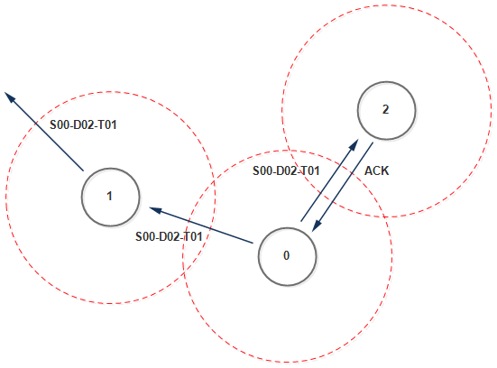

# ESP-NOW Mesh Protocol Library

### TLDR;
Lightweight and fast ESP-NOW (and more) mesh networking library for ESP32 devices.  
Supports multi-hop routing, acknowledgements, node discovery, and packet validation with minimal overhead.

### Overview
This library was developed for a specific use case. It's not revolutionary or world-changing; it simply addresses a problem that has already been solved many times by libraries like ESP-MESH, Meshstastic, and others. It does so for a particular scenario that I needed, and hopefully others might find it useful as well. I keep mentioning specific case, so let's brake it down. 

In a large, remote house where tinkerers live, managing multiple custom IoT projects is just part of everyday life. Ensuring that all devices can communicate with each other without Wi-Fi makes the idea of a mesh network very sexy. The main challenge is to keep it simple (KISS - Keep It Simple, Stupid) while supporting various physical communication interfaces (such as ESP-NOW, radio modules).

This boils down to the following requirements:

* Small footprint: The library is ~600 lines of code (it could be smaller), with a protocol overhead of just 11 bytes (also potentially reducible).
* Portability: It should require less than 1% of code changes, mainly just modifying the print() functions.
* Multi-interface support: It must support multiple communication interfaces. (user-defined `meshPacket_OnDataRecv` and `meshPacket_OnDataSent` functions).

---

## Table of Contents
- [Features](#features)
- [How Does It Work](#How-Does-It-Work)
  - [Route Discovery](#Route-Discovery)
  - [Mesh Hopping](#Mesh-Hopping)
  - [Safety Mechanisms](#Safety-Mechanisms)
  - [Route Aging](#Route-Aging)
- [Installation](#installation)
- [Getting Started](#getting-started)
  - [Initialize the Mesh](#1-initialize-the-mesh)
  - [Process Packets](#2-process-packets)
  - [Handle Incoming Packets](#3-handle-incoming-packets)
  - [Sending a Message](#4-sending-a-message)
- [License & Author](#license--author)
- [TODO](#todo)
---

## Features
- Multi-hop routing via ESP-NOW (default)
- Automatic route aging and management
- ACK-based delivery reliability
- Duplicate packet suppression
- Peer table and routing table management
- Packet queueing (FreeRTOS)
- User-defined packet handler callback
- Very low overhead – designed for IoT nodes
---

## How Does It Work?
Protocol piggy-backs on WiFi protocol and consists of the following header. 

```
struct __attribute__((packed)) meshPacket_t
{
  uint8_t sourceID;
  uint8_t destinationID;
  uint8_t packetType;
  uint8_t payloadLength;
  uint8_t TTL;
  uint16_t uniqueIdentifier;
  uint32_t reserved;
  char payload[244];
};
```

The whole header consist of 11 bytes, suitable for embedded systems like ESP32. The maximum payload size is 244 bytes. 

### Route Discovery
 \
Opportunistic route discovery mechanism is used. Devices learn routes simply by receiving packets, making the routing table management automatic and reactive.

The above example shows how routes are built. Upon initial transmission a source node (S00) sends a packet to a destination (D02) for which it has no established route (no match in routing table), it fallbacks to broadcasts the packet to all its neighbors (FF:FF:FF:FF:FF:FF).
Intermediate nodes (ex., Node 01) receive the broadcast packet. If the packet is not for them, they forward it. During this forwarding process, the reverse path: "to reach Sxx, forward via MAC" is opportunistically learned. This learned route is then stored.
The intended recipient (D02) receives the packet, fires a callback and sends an ACK back to the source. This ACK also travels along a learned reverse path, reinforcing the direct connection.

 \
Once a route (or its reverse) is learned, Next time S00-D02-T01 packet is transmitted direct path is used, significantly improving efficiency. Additionally, using ESP-NOW packet re-transmission is handled 
inside the library. The packet is resent for up to 10 times. 

### Mesh Hopping
 \
A mesh network woundn't be complete without hopping. The above example shows initial transmission with more nodes than in the previous example. By following logic described in **Route Discovery** section it can be seen
how S00-D03 message is sent and ACK is received. This example is important to show to understand a few important points.

Backward routes are learned based on "fastest win" meaning protocol doesn't optimize the routes once they are established. 

### Safety Mechanisms
Since, a fallback transmisstion rely on broadcasting dublicate messages cannot be avoided in heavily packet areas. To manage this, the protocol stores a rotation `uniqueIdentifier` in each packet header. 
When a device receives a packet, it checks the `uniqueIdentifier` and `sourceID`. If a match is found, the packet is dropped to prevent duplicates. Unique processed packets are remembered (table size is 25 entries).
Additionally, the packet header includes a TTL (Time To Live), borrowed from the TCP/IP protocol. This parameter controls the maximum number of hops a packet can have. Each time the packet is routed, the TTL is decremented (default set to 5). This mechanism helps optimize route discovery and prevents potential routing loops.
To mitigate network saturation in heavily congested areas, flood control is implemented by introducing slight random delays before forwarding packets. Each packet experiences a delay of 1 to 5 milliseconds, reducing the chances of collision and/or broadcast storms.

### Route Aging
To prevent stale nodes from sabotaging the network, route aging is used. Each device's routing table includes a `lastSeen` timestamp, which is updated every time a packet from a node is received. If no packets are received from a particular node for longer than the default duration of 10 minutes, that route is considered stale and is removed from the routing table.

---

## Installation
1. Download or clone this repository
2. Place it in your Arduino libraries directory:

```
Documents/Arduino/libraries/meshProtocol/
```

3. Restart Arduino IDE
---

## Getting Started

### 1. Initialize the Mesh

Call in `setup()`:

```cpp
meshPacket_init(uint8_t wifiChannel); //- Set the channel to match a Wi-Fi channel (default is 1).
```

---

### 2. Process Packets

Call in `loop()` or a FreeRTOS task:

```cpp
void meshPacket_processPackets(uint8_t *acceptedDeviceIDs, uint8_t acceptedDeviceCount, uint32_t waitTime_ms);
```

`acceptedDeviceIDs` the pointer sets the accepted device IDs, so packets can be filtered accordingly. Use `(uint8_t[]){LOCAL_DEVICE_ID}, 1` to accept only native device.
`acceptedDeviceCount` make sure it matches device count in a `acceptedDeviceIDs` pointer. \
`waitTime_ms` specifies the wait time for new mesh packets when the queue is empty. Set it to `0` if this feature is not used.

---

### 3. Handle Incoming Packets

Override the weak callback (example):

```cpp
void meshPacket_handlePacketCallback(meshPacket_t *localPacket)
{
  switch(localPacket->packetType)
  {
    case PACKET_TYPE_CONTROL:
    {
      Serial.println("Control packet received!");
      break;
    }
    default:
    {
      Serial.printf("[ERROR]: S%02d, D%02d, invalid T%02d received\n", localPacket->sourceID, localPacket->destinationID, localPacket->packetType);
      break;
    }
  }
}
```

---

### 4. Sending a Message

```cpp
uint8_t payload[] = { 1, 2, 3, 4 };
meshPacket_sendMessage(LOCAL_DEVICE_ID, DEVICE_ID_MPPT_CONTROLLER, PACKET_TYPE_CONTROL, payload, sizeof(payload));
```

---

## License & Author

MIT / Beerware.

If you find this useful, buy the author a beer 🍺 :) \
**Dovydas Bružas, Lithuania** <Dovydisimo@gmail.com>

---

## TODO

To do's right now are inside .h file. Will move to README.md at some point.

